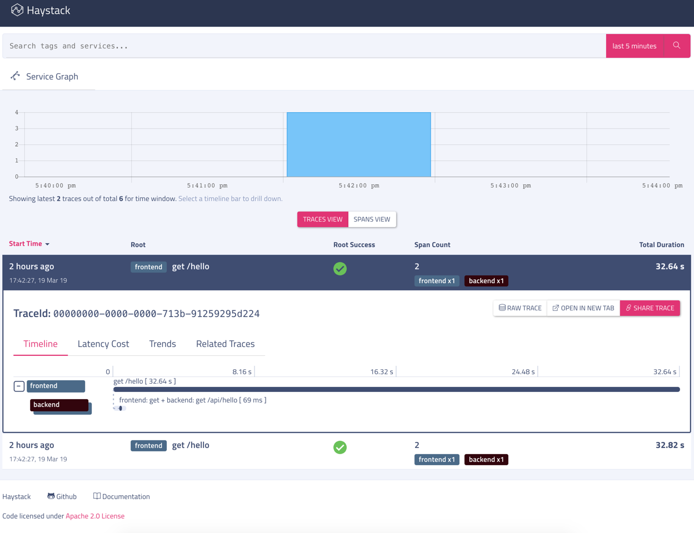
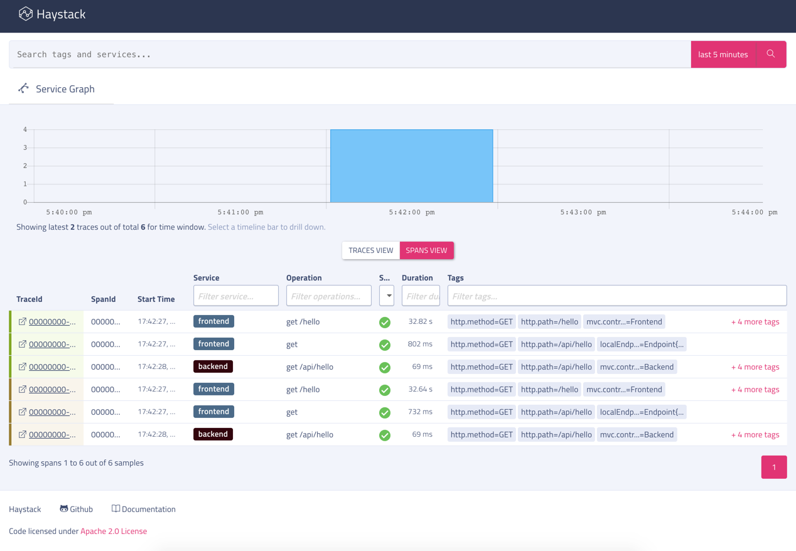

[](https://travis-ci.org/ExpediaDotCom/spring-cloud-sleuth-haystack-reporter-example)
[](https://github.com/ExpediaDotCom/haystack/blob/master/LICENSE)
## Table of Contents

- [Spring Cloud Sleuth Haystack Reporter Example](#spring-cloud-sleuth-haystack-example)
- [About this example](#about-this-example)
  * [Instrumentation](#instrumentation)
- [Running this example](#running-this-example)
  * [Build](#build)
  * [Run with no backend](#run-with-no-backend)
  * [Run with Haystack server](#run-with-haystack-server)

## Haystack-dropwizard

In this example, the two Spring Sleuth services call one from another to show a client and server working with tracing instrumentation. Telemetry from this application is recorded in [Haystack](http://expediadotcom.github.io/haystack/) server, a distributed tracing system. Haystack will allow one to see the service call dependency and how long it took for the whole operation to complete. Here is what a sample output in the UI will look like: 



## About this example

This is a very basic example that can output the instrumentation to console and/or a Haystack server. This is an example application written with two simple Spring Services to show how a Spring application can be instrumented with [spring-cloud-sleuth-haystack-reporter](https://github.com/ExpediaDotCom/spring-cloud-sleuth-haystack-reporter) and [Spring Cloud Sleuth](https://github.com/spring-cloud/spring-cloud-sleuth). 

* Frontend service:  This listens on port 9090 and exposes one endpoint: http://localhost:9090/hello  - this in turn calls the endpoint exposed by `Backend` and proxy the response

* Backend service:  This listens on port 9091 and exposes one endpoint : http://localhost:9091/api - when invoked, it returns a simple string like `Hello, It's Tue Mar 19 21:46:29 IST 2019`

### Instrumentation

If one peeks into the code, both [Frontend.java](src/main/java/com/expedia/www/spring/cloud/sleuth/haystack/reporter/example/Frontend.java) and [Backend.java](src/main/java/com/expedia/www/spring/cloud/sleuth/haystack/reporter/example/Backend.java) are simple Spring boot applications with no additional instrumentation code other than `@Autowired` Tracer used just for logging purpose. All of the required wirings are done using Spring sleuth using the config provided in [application.yml](src/main/resources/application.yml).
The Haystack reporter and Spring Sleuth are automatically configured. Though there is one thing to take care of, that is if we need to trace all our requests we should create a Sampler bean as shown below
 
```java_holder_method_tree
@Bean
Sampler sampler() {
   return Sampler.ALWAYS_SAMPLE;
}
```
## Running this example

### Build

Required:

* Java 1.8


Build:

```bash
./mvnw clean compile
```

We need a haystack server to run this example so that traces are reported to haystack.

### Run with Haystack server

To start haystack and agent locally, one can follow the instructions at [https://github.com/ExpediaDotCom/haystack-docker#to-start-haystacks-traces-trends-and-service-graph](https://github.com/ExpediaDotCom/haystack-docker#to-start-haystacks-traces-trends-and-service-graph)
 
After starting Haystack server, run this example with the following commands. This starts the application with the configuration in [frontend_remote.yml](frontend_remote.yml) and [backend_remote.yml](backend_remote.yml)

```bash
./mvnw exec:java -Dexec.args="frontend"
./mvnw exec:java -Dexec.args="backend"
```

and send a sample request

```bash
curl http://localhost:9090/hello
```

And then open Haystack UI at [http://localhost:8080/](http://localhost:8080/) and search for `serviceName=frontend` to see the traces. (see screenshot above)

One can also use the sample script we have to send more requests to the sample application.

```bash
./run.sh
```

Screenshot of the spans view.




   
